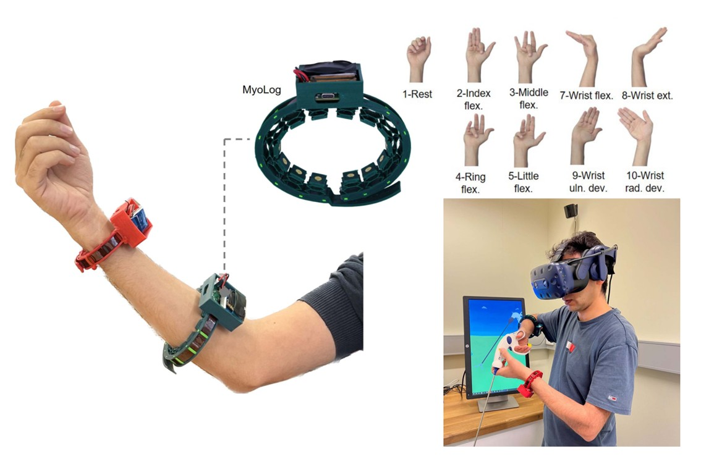

## Wearable Soft Sensor System for Hand Gesture Recognition

**This integrated sensor system includes a 3D-printable soft sensor body and an embedded system for signal processing and data transmission. The system is highly wearable and can achieve 97.7% accuracy in identifying 13 hand gestures. It can be applied to virtual reality interaction and prosthesis control.**

- Programmed the **ESP32** microcontrollers, implementing sensor-data acquisition and transmission firmware using **SPI**, **ADC**, **BLE**, and **WiFi**, and developed a virtual reality interaction environment using **Unity (C#)**.



- Manufactured the sensor body using 3D printing with a soft material (TPU).

- Collaborated with colleagues at [Human Robotics Lab](https://blogs.unimelb.edu.au/human-robotics/). Published in IEEE Journal of Biomedical and Health Informatics (IEEE JBHI). The paper is available [here](https://bpb-ap-se2.wpmucdn.com/blogs.unimelb.edu.au/dist/5/342/files/2025/03/Mohohammadi-25-An_Information-Rich_and_Highly_Wearable_Soft_Sensor_System_for_Practical_Hand_Gesture_Interfaces.pdf).

