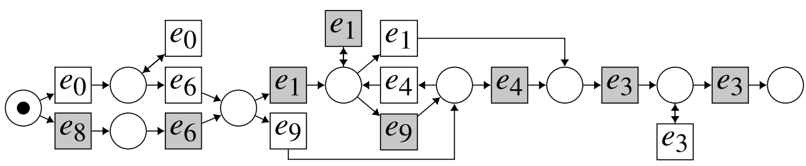



## Uncertainty-aware Prosthesis Control based on Bayesian Learning
**Minimised undesired prosthesis movements caused by environmental uncertainties. Achieved a 30% reduction in task completion time compared with conventional methods (statistically significant).**

* Developed the decision-making system involving biosignal processing (**EMG** and **joint kinematics**), motion control, and machine learning.

* Built a dedicated experimental platform using **Unity (C#)** for VR simulation and high-frequency data logging, and **ESP32** for sensor data acquisition and transmission firmware, and **Python** for online decision-making.

* Published in IEEE Transactions on Neural Systems and Rehabilitation Engineering (IEEE-TNSRE). Paper can be found [here](https://ieeexplore.ieee.org/document/10654345). VR platform code can be found [here](https://github.com/UniMelbHumanRoboticsLab/VRProEP). Dataset can be found [here](https://doi.org/10.26188/25592115).



****
## Real-time Optimisation & Personalisation using Extremum Seeking Control
**Enable real-time adjustment of controller parameters for optimal performance. Reduced compensatory movement of trunk and shoulder (statistically significant).**

* Programmed the **ARM Cortex-M0** and **ESP32** microcontrollers, implementing Extremum Seeking Control and sensor-data acquisition firmware on FreeRTOS and bare-metal using **DMA**, **I2C**, **SPI**, **ADC**, and **BLE**.
* Designed and manufactured the mechatronic prototype using 3D printing and laser cutting.

*  Collaborated with colleagues at [Human Robotics Lab](https://blogs.unimelb.edu.au/human-robotics/). Published in IEEE Robotics and Automation Letter (IEEE-RAL). Paper can be found [here](https://www.researchgate.net/publication/339675253_Exploiting_Inherent_Human_Motor_Behaviour_in_the_Online_Personalisation_of_Human-Prosthetic_Interfaces). Dataset can be found [here](https://github.com/Rigaro/CompensationInSynergisticProsthesisData2020).



****
## Process-mining-based Framework for Human Intention Detection
**Developed a reasoning framework for human intention detection leveraging process-mining techniques and Petri nets.**

* Example: A Petri net is extracted from EMG and motion data of a human subject reaching a single target, with actions \(e_i\) connected through state nodes (circles). The grey actions represent a specific type of movement event starting from the filled circle.

* Collaborated with colleagues at [Process Science and Technology Research Group](https://cis.unimelb.edu.au/research/information-systems/process-science-and-technology) and [Human Robotics Lab](https://blogs.unimelb.edu.au/human-robotics/). Published in Information Systems and ICPM. Paper can be found [here](https://doi.org/10.1016/j.is.2025.102540). Code and data can be found [here](https://doi.org/10.26188/25487290)

